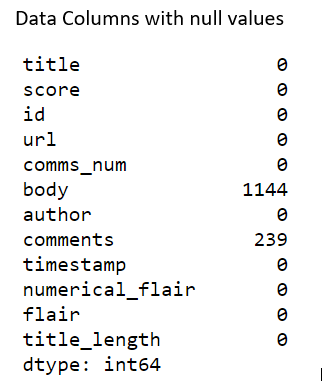
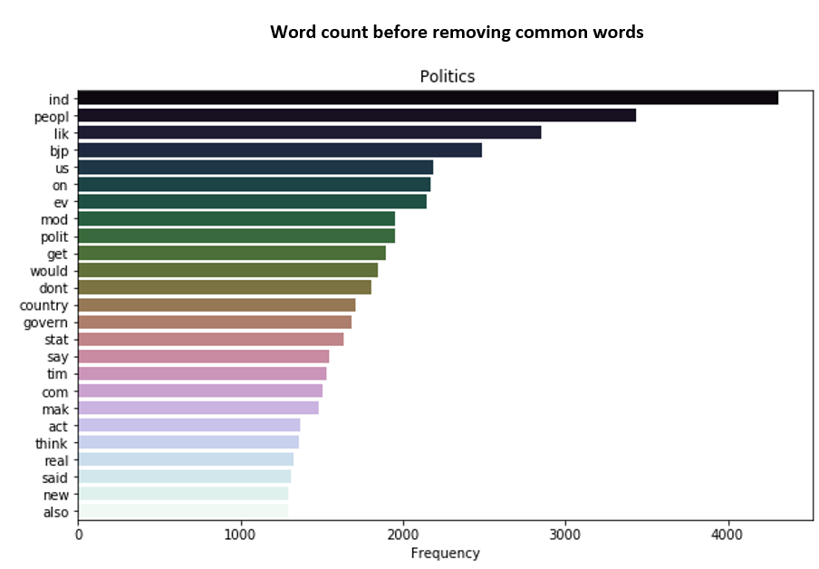
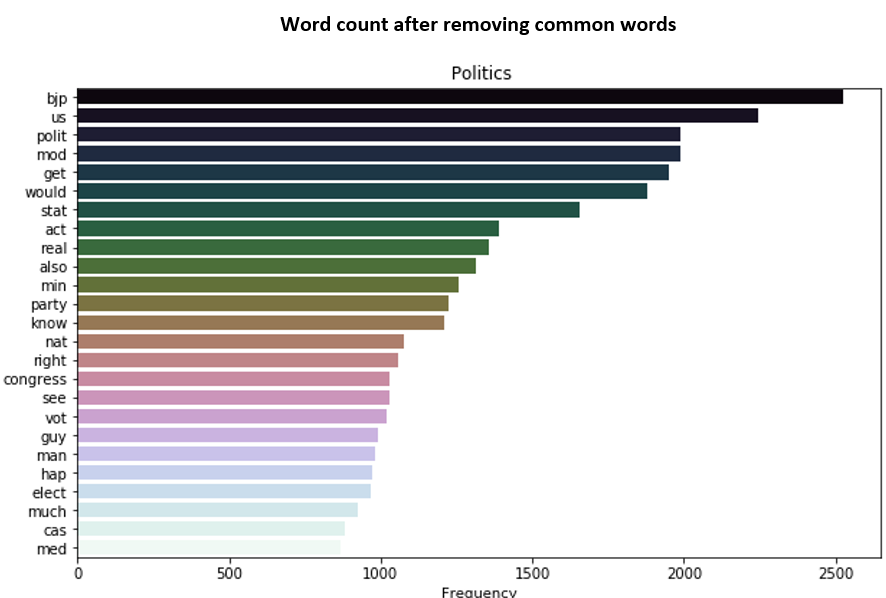
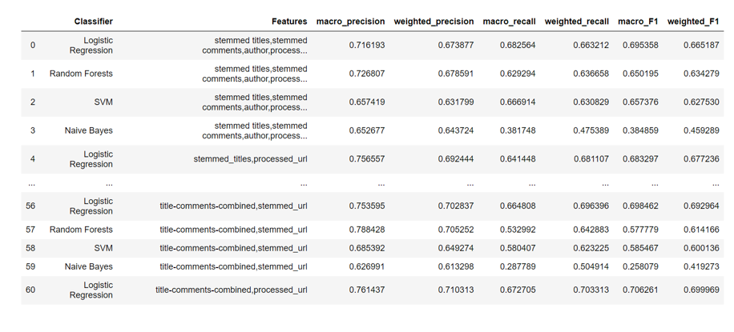
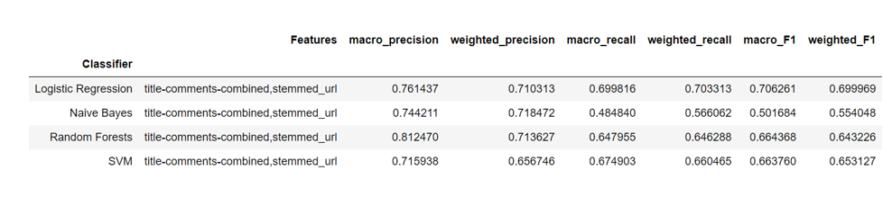
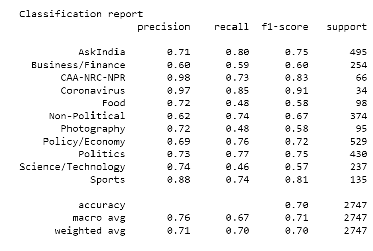

# Reddit-Flair-Detector
A machine learning classifier to predict the flairs of posts of the r/india subreddit deployed to Heroku using the Flask API

# Website 
https://lit-brook-22563.herokuapp.com/

# Using the Website 
 Provide a URL of an r/india subreddit post in its valid form. The website will seach the post by extracting its postid and predict the flair of the post.   
The automated testing point accepts a .txt documents with a post link in each line, and will return a json file in the output endpoint.  **PLEASE NOTE: The heroku servers put a 30 second timeout on the automated endpoint testing, hence a large number of URLs are not being processed currently since it shows timeout error**. 
# Index 
1.	Project Description
2.	Data Extraction 
3.	Data Pre-processing and Modification
4.	Model development and Testing
5.	Model Summary  
6. References  
 The **‘Main_Project’** folder contains all the html files and the Python files to create the Flask webapp. 

# Project Description
 The project aims to develop a flair detector for the r/India subreddit. The project was developed in Python in Jupyter Notebooks and     deployed using Flask on Heroku.   
 The Jupyter notebooks and their description are as follows:

### Jupyter Notebooks:
*	Praw Data Extraction :Extracting Data using the Praw API (Part 1)
*	Data Extraction using pushshifts : Extending the training set using the Pushshifts API (Part 1)  
*	Data Pre-Processing: Processing the data in the different datasets and subsequent subsets produced. (Part 2) 
*	Data Exploration and Modification: Modifying the training set, finding data correlation and structure of data values and creating other modified databases. (Part 2)  
*	Model Training: training the different models on variety of features and choosing the final model.(Part 3)   
*	Flair Prediction Model: contains the final model and data processing functions to predict post flair from the input URL.(Part 3) 

### Libraries Used:
The following libraries were used for data exploration and model development –
* Numpy, Pandas 
* Sklearn: for models and feature selection
* Praw for data extraction
* Nltk: for NLP
* Seaborn, matplotlib: for Data visualisation
* GridSearchCV was used for feature selection for the ML models. 

# Data Extraction

 Data was initially extracted using the PRAW module for Reddit data selection from the r/india subreddit.
 Data was sorted on the basis of post scores to select the relatively popular posts which have more text content . 
 The following flairs are present in the r/india subreddit :
 Politics			    Non-Political			    AskIndia	    Policy/Economy	
 Business/Finance 	Science/Technology		Sports		    Food
 Photography 		  CAA-NRC-NPR			      Coronavirus	  Rediquette
 The following number of datapoints were extracted from each flair

**Body was the primary content missing even in the most popular posts** and subsequent post extractions, 
 hence it was removed as a training feature. 

### Using Pushshifts API to get more Data
 To increase the size of our training data, we used the Pushshifts API to extract more posts from Reddit.
 To avoid data duplicacy between this data and the previous extraction, posts dated before 2018 December were removed from the PRAW dataset. 
 
 The following datapoints were obtained from the Pushshifts API
 

 The 2 datasets were combined to form the **combined_df.csv**.
 Posts dated before Dec 2018 in the PRAW dataset were removed to avoid  post  duplicacy. 
 
 &nbsp; 

 
  **Combined_df dataset**

# Data Pre-Processing and Modification
### Numerical Data Analysis
 No strong correlation was found in the numerical data of posts. Numerical data points like post scores , title lengths , size of comments etc had no correlation to any particular flair and hence were not used for training the model. 

**Post Scores**  
  
 Many flairs had high score averages. Scores were not used for training the data.  
**Number of Post Comments**
  
 Almost all the flairs had a similar number of comments. Hence, comments could be used for training the model without creating bias and disparities.   
 
 ### Data Cleaning
 The text data was processed to be used as training data for the ML model. First, posts with null values were removed.               
  
  
  The title and comment texts for all the posts were cleaned and processed. 
1.	First, text was converted to lower form and all forms of punctuation were removed 
2.	**Word stemming was done using the LancasterStemmer** from nltk.stem and stopwords were removed from the text data, since they don’t contribute and unique identifying words to the text. 
Stemming was chosen since we do not require the actual meaning of the text data, but rather we are searching for unique text identifiers from each flair and do not require a vocabulary to maintain word meaning. 
3.	URL and post titles were processed similarly. 

As is apparent from the flair count for the combined_df dataset, there is a post count disparity between the flairs, with some having exceedingly high number of posts while others having low number of posts.  
Hence, datasets **strip_data and sec_strip_data** were created from the original dataset which had an equivalent number of posts for each flair. 
This was done by removing the relatively unpopular posts from the flairs with more post count.

### Extending the list of Stopwords 
To increase model efficiciency, a word count was obtained from each flair using the CountVectorizer and the commonly occurring words from each flair were removed by extending them into the list of stopwords. 

    

This was done similarly on the **stemmed titles and stemmed URLs**  
and their corresponding list of stopwords extended and the words removed. 

# Model Development and Testing 

The following models were used –  
 **Linear Regression	,   Random Forests,	   Multi Layer Perceptron	,   Support Vector Machine	,   Naïve Bayes Classifier**
 
 They were used alongside a **CountVectorizer and TfIdf Transformer** in a pipeline. 
Model parameters were found using GridsearchCV for each ML model.   
In the initial runs, the MLP model showed the lowest scores and took more time to compile hence was removed from further testing. 

 The models were trained on 2 datasets:  
 * the combined dataframe(more posts but also more post count disparity between flairs)  
 
 * stripped dataframe(relatively equal number of posts for each flair)  

 **Although, more efficiency was found in the larger dataset**
  
  
  
   The highest efficiency for each model was as follows :
   

 Although the Random Forests model had a larger macro precision and weighted precision, **it had a lower F1 score than the Logistic Regression model and took more time to compile**.     
 
 Hence, the **Logistic Regression model was chosen which was trained on the title-comments-combined and stemmed-url features.**
 
 
 
 The model had a precision of **76%** on a dataset containing about **6000 datapoints.**
 
 # Model Summary
 ### Positives:  
 * Trained on a large dataset of about 9000 datapoints.   
 * High precision of 76% achieved on the dataset. 
 * Some flairs got a precision score of 90%+.   
 ### Negatives :  
 * Requires text data in comments and titles. Wont work well on unpopular posts with small number of comments.   
 * Some of the posts in Business & Finance and Policy/Economy are mixed up due to a similar word distribution and theme of discussion.   
 * Non Political has a non unique word distribution, hence some posts are not easily identified by the model.  
 Note: Due to the recent politicisation of the Coronavirus situation, some recent post flaired under the same may be predicted as Politics   by the model. 
 

# References
**Scraping Reddit Data**: https://towardsdatascience.com/scraping-reddit-data-1c0af3040768  
**Using pushshifts api**: https://medium.com/@RareLoot/using-pushshifts-api-to-extract-reddit-submissions-fb517b286563  
**Deploying to Heroku**:  https://www.geeksforgeeks.org/deploy-python-flask-app-on-heroku/

